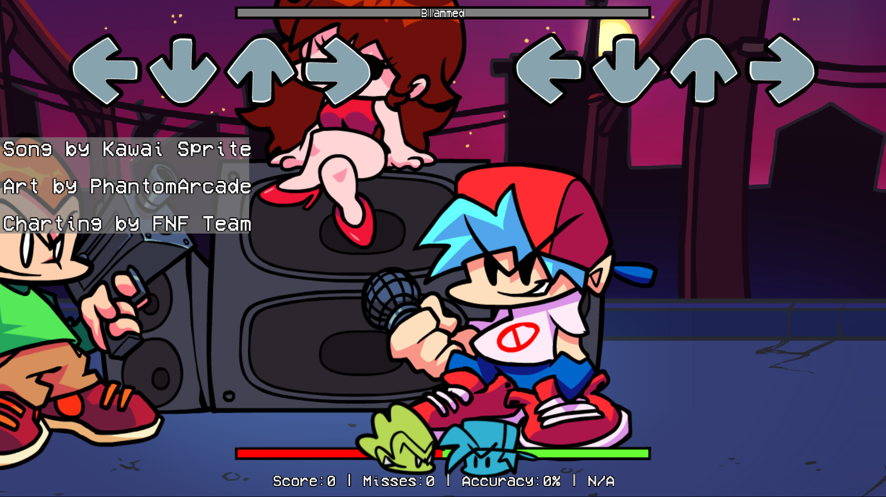

# Friday Night Funkin': J4Y Engine

### If you want to build J4Y Engine, read [this](https://rentry.org/scsv3w).

## Friday Night Funkin'
**Friday Night Funkin'** is a rhythm game originally made for Ludum Dare 47 "Stuck In a Loop".

Links: **[itch.io page](https://ninja-muffin24.itch.io/funkin) ⋅ [Newgrounds](https://www.newgrounds.com/portal/view/770371) ⋅ [Source Code](https://github.com/ninjamuffin99/Funkin)**
> Uh oh! Your tryin to kiss ur hot girlfriend, but her MEAN and EVIL dad is trying to KILL you! He's an ex-rockstar, the only way to get to his heart? The power of music... 

## J4Y Engine
**J4Y Engine** is a mod for Friday Night Funkin' with convenient features!.

Links: **[GameBanana](https://gamebanana.com/tools/15234)**

**REMINDER**: This is a **mod**. This is not the vanilla game and should be treated as a **modification**. This is not and probably will never be official, so don't get confused.

# Previews

# Features

- **Centered Strumline, Camera Movement, and Song Credits**
	- Added centered strumline, camera movement, and song credits whilst in gameplay due to it making the HUD look more organized and such lmao.
- **Extra Score Text Details**
	- While you're playing, it shows more information under the healthbar showing a Miss, Accuracy, and Grading information.
- **Keybinds**
	- Instead of being forced to use WASD, you can use WASD, DFJK, ASKL, and ZX,.!
- **And much, much more!**
	- Theres many inside of this engine, and even MORE will get added in 2.0 and afterwards.

# Credits

### Friday Night Funkin'
- [ninjamuffin99](https://twitter.com/ninja_muffin99) - Programming
- [PhantomArcade3K](https://twitter.com/phantomarcade3k) and [Evilsk8r](https://twitter.com/evilsk8r) - Art
- [Kawai Sprite](https://twitter.com/kawaisprite) - Music

This game was made with love to Newgrounds and its community. Extra love to Tom Fulp.

### J4Y Engine
- [J4Y (me!)](https://www.youtube.com/@JJ44YY.) - Maintainer and Lead Creator of J4Y Engine

### Shoutouts
- [KadeDeveloper](https://twitter.com/KadeDeveloper) - Inspired me to do J4Y Engine (+ used some code from the engine)
